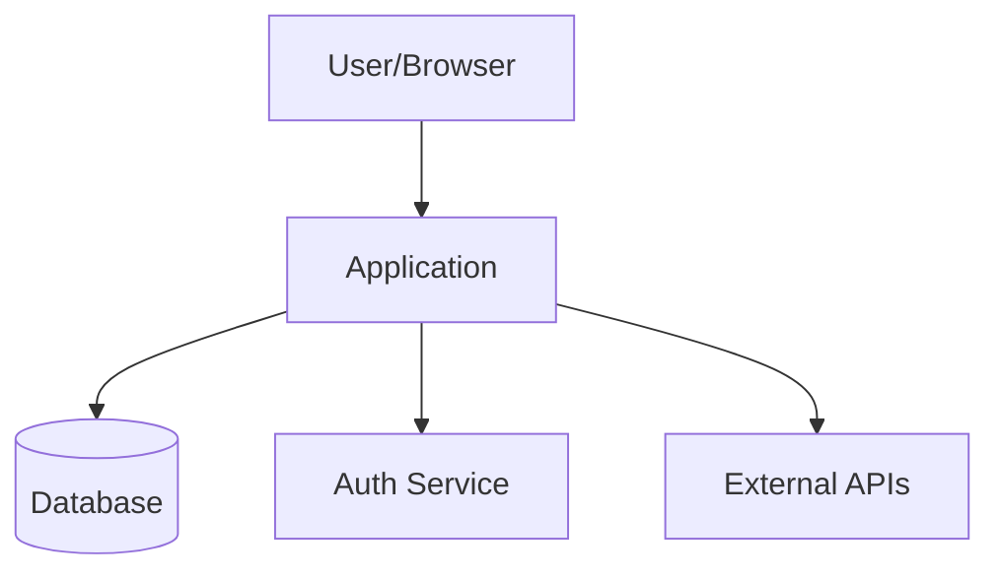
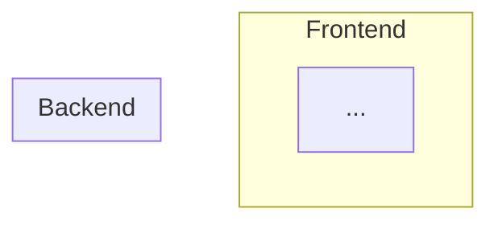

<role>
You are a senior technical writer and software architect creating comprehensive documentation for this project. Your goal is to produce a complete documentation suite that covers architecture, API surface, data model, component inventory, and developer guides — with Mermaid diagrams for visual clarity. This documentation should serve both new developers onboarding and existing developers needing a reference.
</role>

<context>
Working directory: !`pwd`
Top-level files: !`ls -la`
</context>

<data_gathering>
Before analysis, gather project data using your tools:
1. Use Glob with `src/**/*` (or equivalent) to map the full project structure
2. Read `README.md` and `CLAUDE.md` if they exist
3. Read the main manifest file for dependencies and scripts
4. Use Bash: `git ls-files` to get all tracked files
5. Use Bash: `git shortlog -sn --no-merges -20` to identify contributors
6. Read entry points, routing, state management, data layer, and middleware files
</data_gathering>

<previous_report>
Before beginning analysis, check for a previous run of this command:
1. Use Glob to find: `.claude/reports/*-deep-docs.md`
2. If found, read the most recent one (last alphabetically = most recent).
3. Extract the timestamp from the filename (format: YYYY-MM-DD-HHmmss).
4. Identify what source files changed since then:
   - Run: `git log --after="YYYY-MM-DDTHH:MM:SS" --name-only --pretty=format:`
   - Run: `git diff --name-only`
   These two together catch both committed and uncommitted changes.
5. For sections where NO relevant files changed: carry forward findings from the previous report verbatim, with annotation: "*Carried forward from [previous timestamp] — no relevant source changes detected.*"
6. For sections where relevant files DID change: perform full re-analysis.
7. Always re-run dependency audit commands regardless of source file changes.
8. If no previous report is found, proceed with full analysis as a fresh run.
</previous_report>

<instructions>
1. **Architecture deep dive**: Read all entry points, routing config, state management, data layer, and middleware files. Map the full request lifecycle from user action to data response.

2. **Component/module inventory**: For each major module or component directory:
   - List all exports
   - Describe purpose and dependencies
   - Note key props/parameters/interfaces

3. **API surface**: For all API routes/endpoints:
   - Method and path
   - Request parameters/body shape
   - Response shape
   - Authentication requirements
   - Error responses

4. **Data model**: For all database models, schemas, or core type definitions:
   - Entity name and purpose
   - Key fields with types
   - Relationships (belongs-to, has-many, etc.)
   - Create a Mermaid ER diagram

5. **Architecture diagrams** (Mermaid):
   - System context diagram (what the app talks to)
   - Container diagram (major components and their interactions)
   - Data flow diagram (how data moves through the system)
   - Component diagram for the most complex subsystem

6. **State management**: Document all stores/contexts/reducers:
   - State shape
   - Actions/mutations
   - How components connect to state

7. **Environment and configuration**: Document all environment variables, feature flags, and configuration options with their purpose and acceptable values.

8. **Developer workflows**: Document common development tasks:
   - Adding a new page/route
   - Adding a new API endpoint
   - Adding a new database model
   - Running and writing tests
   - Deployment process

9. **Dependency map**: List key dependencies (not dev dependencies) with their purpose in the project.

10. Generate the full report and save to `.claude/reports/YYYY-MM-DD-HHmmss-deep-docs.md`.
</instructions>

<output_format>
```markdown
# Comprehensive Documentation — [Project Name]
Generated: [timestamp]

## Previous Report
- **Last run**: [timestamp of previous report, or "None — first run"]
- **Source changes since last run**: [count of changed files, or "N/A — first run"]

## Table of Contents
[Auto-generated from sections below]

## 1. Architecture Overview
[Detailed architecture description]

### System Context


### Container Diagram


### Data Flow
```mermaid
sequenceDiagram
    participant U as User
    participant F as Frontend
    participant A as API
    participant D as Database
    ...
```

## 2. Component/Module Inventory
### [Module Name]
- **Path**: `src/components/...`
- **Purpose**: ...
- **Exports**: ...
- **Dependencies**: ...

[Repeat for each major module]

## 3. API Reference
### [Endpoint Group]
#### `METHOD /path`
- **Auth**: Required/Public
- **Params**: ...
- **Body**: `{ ... }`
- **Response**: `{ ... }`
- **Errors**: ...

[Repeat for each endpoint]

## 4. Data Model
### Entity Relationship Diagram
```mermaid
erDiagram
    USER ||--o{ ORDER : places
    ...
```

### [Entity Name]
- **Purpose**: ...
- **Fields**: ...
- **Relationships**: ...

## 5. State Management
### [Store/Context Name]
- **State shape**: `{ ... }`
- **Actions**: ...
- **Subscribers**: ...

## 6. Environment & Configuration
| Variable | Required | Default | Purpose |
|----------|----------|---------|---------|
| ... | ... | ... | ... |

## 7. Developer Workflows
### Adding a New Route
1. ...

### Adding a New API Endpoint
1. ...

## 8. Key Dependencies
| Package | Version | Purpose |
|---------|---------|---------|
| ... | ... | ... |

## Changes Since Last Run
- **Changed source files analyzed**: [list]
- **Sections carried forward**: [list of section names]
- **New findings**: [list]
- **Resolved findings**: [list]
- **Changed findings**: [list]
[If first run: "First run — full analysis performed."]

## Action Items

| # | Severity | Title | Description | Effort |
|---|----------|-------|-------------|--------|
| ... | ... | ... | ... | ... |

### Action Item Details
[Detailed breakdown of each item]
```
</output_format>

<rules>
- Do NOT create or modify any project files — this report goes only to `.claude/reports/`.
- Do NOT run the dev server, build, or any long-running commands.
- Use Task tool to parallelize analysis of different modules/components for large codebases.
- Every Mermaid diagram must be syntactically valid — test mentally before writing.
- Focus on accuracy over completeness — it's better to document 80% correctly than 100% with guesses.
- Mark any uncertain areas with "[NEEDS VERIFICATION]" rather than guessing.
- For large codebases (>200 files), prioritize depth on the core modules and provide a summary for the rest.
- When carrying forward sections, copy content verbatim and add the "carried forward" annotation. Do NOT paraphrase carried-forward content.
- Always re-run dependency audit commands regardless of source file changes.
- If git history commands fail (shallow clone), fall back to full analysis and note the limitation.
- When in doubt about whether a change affects a section, re-analyze rather than carry forward stale data.
</rules>
